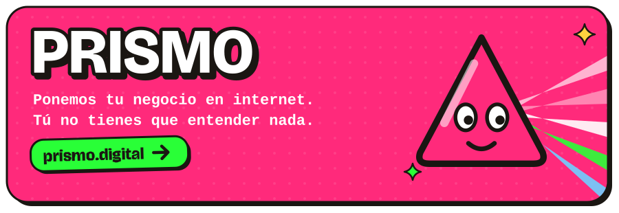
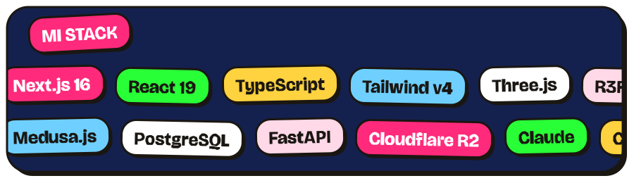
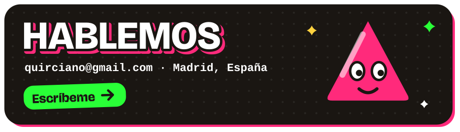

## Mis movidas

## Con lo que curro

## Ahora ando…

- Sacando **La Estantería Oculta** de Shopify y montándole tienda propia con Next.js y Medusa, porque las comisiones duelen.
- Puliendo **Filarmonic**, que te corrige la armonía sin poner caras.
- Con **Prismo**, haciendo webs y bots para negocios de barrio que no tienen tiempo para estas movidas.
- Y compartiendo las skills de Claude Code que uso a diario: [claude-skills-collection](https://github.com/Quirciano15/claude-skills-collection).

